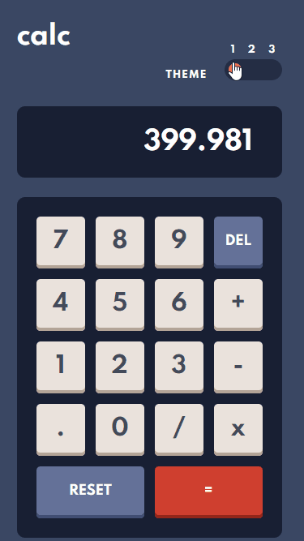

# Frontend Mentor - Stats preview card component solution

This is a solution to the [Stats preview card component challenge on Frontend Mentor](https://www.frontendmentor.io/challenges/stats-preview-card-component-8JqbgoU62). Frontend Mentor challenges help you improve your coding skills by building realistic projects.

## Overview

### Screenshot

### Links

- Solution URL: [https://github.com/ThiCode126/calculator-fem](https://github.com/ThiCode126/calculator-fem)
- Live Site URL: [https://calculator-fem-thicode.netlify.app](https://calculator-fem-thicode.netlify.app)

## My process

### Built with

- Semantic HTML5 markup
- CSS custom properties
- Flexbox
- CSS Grid
- Mobile-first workflow
- [React](https://reactjs.org/) - JS library

## Author

- Website - [thicode.fr/](https://thicode.fr/)
- Frontend Mentor - [@ThiCode126](https://www.frontendmentor.io/profile/ThiCode126)
- Twitter - [@code_thi](https://twitter.com/code_thi)
